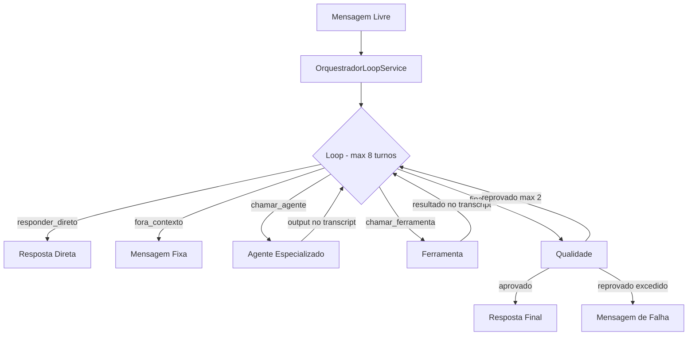

# API Reference - Telegram Bot

## Comandos

### `/start`

Mensagem de boas-vindas.

**Exemplo:**
```
/start
```

**Resposta:**
```
Bem-vindo! Sou o DemoAgencia Bot. Use /help para ver os comandos disponíveis.
```

---

### `/help`

Lista todos os comandos disponíveis e agentes.

**Exemplo:**
```
/help
```

**Resposta:**
```
Comandos:
/start - Inicia o bot
/help - Mostra esta ajuda
/agentes - Lista agentes disponíveis
/limpar - Limpa histórico do chat
/reset - Deseleciona agente e limpa histórico

Mensagens livres são processadas pelo orquestrador multi-agente.

Agentes (atalhos diretos):
/redator - Redator: Especialista em copywriting
/dev - Dev: Especialista em desenvolvimento de pagina html
/estrategista - Estrategista: Especialista em estratégia
/prompt-imagem - Prompt para Imagens: Especialista em direcao de arte
```

---

### `/agentes`

Lista todos os agentes disponíveis com descrição e comandos.

**Exemplo:**
```
/agentes
```

**Resposta:**
```
Agentes disponíveis:

• Redator - Especialista em copywriting e criação de conteúdo persuasivo
  Comandos: /redator

• Dev - Especialista em desenvolvimento de pagina html
  Comandos: /dev

• Estrategista - Especialista em estrategia de negocios e planejamento de marketing
  Comandos: /estrategista

• Prompt para Imagens - Especialista em direcao de arte e prompts de geracao de imagem para marketing
  Comandos: /prompt-imagem
```

---

### `/redator`

Seleciona o agente Redator (copywriting).

**Uso sem args:**
```
/redator
```
**Resposta:** `Agente Redator selecionado. Envie sua mensagem para interagir.`

**Uso com args:**
```
/redator Escreva um slogan para uma cafeteria
```
**Resposta:** [Resposta gerada pelo LLM com persona do redator]

**Modelo:** `qwen/qwen3.7-plus`

---

### `/dev`

Seleciona o agente Dev (desenvolvimento de páginas HTML para e-mail marketing).

**Uso sem args:**
```
/dev
```
**Resposta:** `Agente Dev selecionado. Envie sua mensagem para interagir diretamente.`

**Uso com args:**
```
/dev Crie um template de e-mail marketing para Black Friday
```
**Resposta:** [Código HTML gerado pelo LLM com persona do dev]

**Modelo:** `qwen/qwen-2.5-coder-32b-instruct`

---

### `/estrategista`

Seleciona o agente Estrategista (planejamento).

**Uso sem args:**
```
/estrategista
```
**Resposta:** `Agente Estrategista selecionado. Envie sua mensagem para interagir.`

**Uso com args:**
```
/estrategista Como aumentar vendas de um e-commerce?
```
**Resposta:** [Estratégia gerada pelo LLM com persona do estrategista]

**Modelo:** `deepseek/deepseek-r1-0528`

---

### `/prompt-imagem`

Seleciona o agente Prompt para Imagens (direção de arte).

**Uso sem args:**
```
/prompt-imagem
```
**Resposta:** `Agente Prompt para Imagens selecionado. Envie sua mensagem para interagir diretamente.`

**Uso com args:**
```
/prompt-imagem um gato azul em estilo cyberpunk para Instagram
```
**Resposta:** [Prompt otimizado em inglês gerado pelo LLM]

**Modelo:** `qwen/qwen3.7-plus`

---

### `/limpar`

Limpa o histórico de conversas do chat atual.

**Exemplo:**
```
/limpar
```

**Resposta:** `Historico limpo.`

---

### `/reset`

Deseleciona o agente ativo e limpa o histórico.

**Exemplo:**
```
/reset
```

**Resposta:** `Agente deselecionado e historico limpo.`

---

## Mensagens Livres

Mensagens livres (sem comando) são processadas pelo **loop de orquestração** (padrão supervisor):



### Ações do Orquestrador

| Ação | Descrição | Exemplo |
|------|-----------|---------|
| `responder_direto` | Resposta direta a perguntas simples | "O que é marketing de conteúdo?" |
| `fora_contexto` | Fora do escopo da Suspira (Marketing) | "Qual a capital do Brasil?" |
| `chamar_agente` | Delega a um agente especializado | "Crie um post para Instagram" |
| `chamar_ferramenta` | Usa uma ferramenta (ex: gerar_imagem) | "Gere uma imagem de um gato" |
| `finalizar` | Entregável pronto → QA obrigatório → entrega | Tarefa complexa concluída |

### Loop de Orquestração

O orquestrador opera em um loop de **máximo 8 turnos**, decidindo a cada turno qual ação executar:

1. **🧠 Turno N**: Orquestrador analisa o transcript e decide a ação
2. **✍️ Agente trabalhando**: Agente especializado executa tarefa (output entra no transcript)
3. **🔧 Ferramenta**: Ferramenta executada (resultado entra no transcript)
4. **🔍 Qualidade**: QA revisa o entregável (aprovado/reprovado)

**Proteções do loop:**
- JSON inválido do orquestrador → 1 retry automático
- Ação repetida → aviso para abordagem diferente
- Máximo 8 turnos → mensagem de falha
- QA reprova máx 2 vezes → mensagem de falha

**Progresso:** O bot atualiza a mensagem com o progresso de cada turno.

### Agentes de Produção

| Agente | Especialidade | Modelo |
|--------|---------------|--------|
| Redator | Copywriting e conteúdo | qwen/qwen3.7-plus |
| Dev | Desenvolvimento de páginas HTML (e-mail marketing) | qwen/qwen-2.5-coder-32b-instruct |
| Estrategista | Estratégia de negócios e marketing | deepseek/deepseek-r1-0528 |
| Prompt para Imagens | Direção de arte e prompts de geração | qwen/qwen3.7-plus |

### Agentes Internos (não listados em /agentes)

| Agente | Papel | Modelo |
|--------|-------|--------|
| Orquestrador | Loop supervisor | deepseek/deepseek-v3.2 |
| Qualidade | Revisor crítico independente | deepseek/deepseek-r1-0528 |

### Geração de Imagens

Para solicitar imagens, use mensagens naturais ou o comando `/prompt-imagem`:

**Exemplo via mensagem livre:**
```
Crie uma imagem de um gato azul em estilo cyberpunk
```

**Exemplo via comando:**
```
/prompt-imagem um gato azul em estilo cyberpunk para Instagram
```

**Fluxo (via loop):**
1. Orquestrador detecta intenção de imagem
2. Loop chama agente "Prompt para Imagens" (gera prompt otimizado em inglês)
3. Loop chama ferramenta `gerar_imagem` com o prompt
4. Imagem gerada via `qwen/qwen-image-3-pro`
5. Loop finaliza → QA revisa → entrega

**Resposta:** [Imagem gerada enviada como foto com legenda]

---

## Fotos

Envie uma foto para análise multimodal.

**Sem legenda:**
```
[Envia foto]
```
**Resposta:** Descrição da imagem pelo modelo `qwen/qwen2.5-vl-72b-instruct`.

**Com legenda:**
```
[Envia foto] O que tem nesta imagem?
```
**Resposta:** Análise contextual da imagem.

---

## Streaming

Todas as respostas de texto são enviadas com streaming (edição progressiva):

1. Mensagem inicial enviada imediatamente
2. Mensagem editada a cada ~1 segundo
3. Resposta final quando completa

**Indicador:** "typing..." enquanto processa.

---

## Histórico

- **Limite:** 20 mensagens por chat
- **Isolamento:** Cada chat tem histórico independente
- **Persistência:** In-memory (perdido ao reiniciar)
- **Limpar:** `/limpar` ou `/reset`

---

## Códigos de Erro

| Situação | Resposta |
|----------|----------|
| Comando desconhecido | "Comando não reconhecido. Use /help..." |
| Erro no LLM | "Desculpe, ocorreu um erro..." |
| Erro na imagem | "Erro ao gerar imagem. Tente novamente." |
| Erro na análise | "Erro ao analisar a imagem..." |
| Token não configurado | Log de erro (bot não inicia) |

---

## Rate Limits

- **Telegram:** 30 msgs/seg para o bot
- **Streaming:** Edição throttled a 1s
- **OpenRouter:** Depende do plano (pay-per-use)
- **Langfuse:** 50k traces/mês (free tier)
