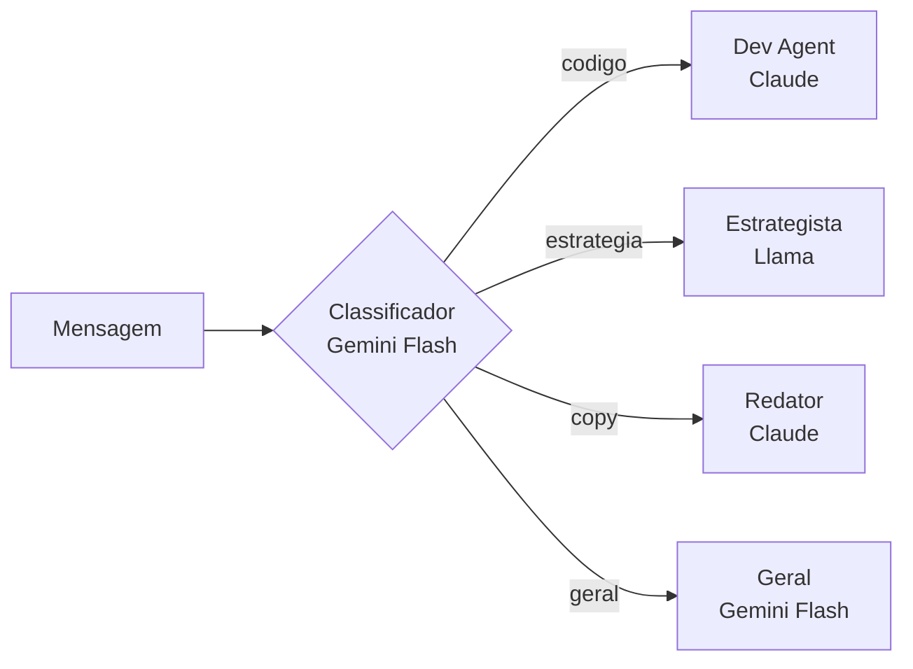

# API Reference - Telegram Bot

## Comandos

### `/start`

Mensagem de boas-vindas.

**Exemplo:**
```
/start
```

**Resposta:**
```
Bem-vindo! Sou o DemoAgencia Bot. Use /help para ver os comandos disponíveis.
```

---

### `/help`

Lista todos os comandos disponíveis e agentes.

**Exemplo:**
```
/help
```

**Resposta:**
```
Comandos:
/start - Inicia o bot
/help - Mostra esta ajuda
/agentes - Lista agentes disponíveis
/imagem <prompt> - Gera uma imagem
/limpar - Limpa histórico do chat
/reset - Deseleciona agente e limpa histórico

Agentes:
/redator - Redator: Especialista em copywriting
/dev - Dev: Especialista em desenvolvimento
/estrategista - Estrategista: Especialista em estratégia
```

---

### `/agentes`

Lista todos os agentes disponíveis com descrição e comandos.

**Exemplo:**
```
/agentes
```

**Resposta:**
```
Agentes disponíveis:

• Redator - Especialista em copywriting e criação de conteúdo persuasivo
  Comandos: /redator

• Dev - Especialista em desenvolvimento de software e arquitetura de código
  Comandos: /dev

• Estrategista - Especialista em estratégia de negócios e planejamento
  Comandos: /estrategista
```

---

### `/redator`

Seleciona o agente Redator (copywriting).

**Uso sem args:**
```
/redator
```
**Resposta:** `Agente Redator selecionado. Envie sua mensagem para interagir.`

**Uso com args:**
```
/redator Escreva um slogan para uma cafeteria
```
**Resposta:** [Resposta gerada pelo LLM com persona do redator]

**Modelo:** `anthropic/claude-3.5-sonnet`

---

### `/dev`

Seleciona o agente Dev (desenvolvimento).

**Uso sem args:**
```
/dev
```
**Resposta:** `Agente Dev selecionado. Envie sua mensagem para interagir.`

**Uso com args:**
```
/dev Crie uma função em Python que soma dois números
```
**Resposta:** [Código gerado pelo LLM com persona do dev]

**Modelo:** `anthropic/claude-3.5-sonnet`

---

### `/estrategista`

Seleciona o agente Estrategista (planejamento).

**Uso sem args:**
```
/estrategista
```
**Resposta:** `Agente Estrategista selecionado. Envie sua mensagem para interagir.`

**Uso com args:**
```
/estrategista Como aumentar vendas de um e-commerce?
```
**Resposta:** [Estratégia gerada pelo LLM com persona do estrategista]

**Modelo:** `meta-llama/llama-3.1-70b-instruct`

---

### `/imagem <prompt>`

Gera uma imagem usando IA.

**Exemplo:**
```
/imagem um gato azul em estilo cyberpunk
```

**Resposta:** [Imagem gerada enviada como foto]

**Modelo:** `openai/gpt-image-1`

---

### `/limpar`

Limpa o histórico de conversas do chat atual.

**Exemplo:**
```
/limpar
```

**Resposta:** `Historico limpo.`

---

### `/reset`

Deseleciona o agente ativo e limpa o histórico.

**Exemplo:**
```
/reset
```

**Resposta:** `Agente deselecionado e historico limpo.`

---

## Mensagens Livres

Quando nenhuma agente está selecionado, o bot classifica automaticamente a mensagem:



**Exemplos:**

| Mensagem | Categoria | Modelo |
|----------|-----------|--------|
| "Como faço um loop em JavaScript?" | codigo | Claude |
| "Me ajude a planejar um lançamento" | estrategia | Llama |
| "Escreva um texto persuasivo" | copy | Claude |
| "Qual a capital do Brasil?" | geral | Gemini Flash |

---

## Fotos

Envie uma foto para análise multimodal.

**Sem legenda:**
```
[Envia foto]
```
**Resposta:** Descrição da imagem pelo Gemini Flash.

**Com legenda:**
```
[Envia foto] O que tem nesta imagem?
```
**Resposta:** Análise contextual da imagem.

---

## Streaming

Todas as respostas de texto são enviadas com streaming (edição progressiva):

1. Mensagem inicial enviada imediatamente
2. Mensagem editada a cada ~1 segundo
3. Resposta final quando completa

**Indicador:** "typing..." enquanto processa.

---

## Histórico

- **Limite:** 20 mensagens por chat
- **Isolamento:** Cada chat tem histórico independente
- **Persistência:** In-memory (perdido ao reiniciar)
- **Limpar:** `/limpar` ou `/reset`

---

## Códigos de Erro

| Situação | Resposta |
|----------|----------|
| Comando desconhecido | "Comando não reconhecido. Use /help..." |
| Erro no LLM | "Desculpe, ocorreu um erro..." |
| Erro na imagem | "Erro ao gerar imagem. Tente novamente." |
| Erro na análise | "Erro ao analisar a imagem..." |
| Token não configurado | Log de erro (bot não inicia) |

---

## Rate Limits

- **Telegram:** 30 msgs/seg para o bot
- **Streaming:** Edição throttled a 1s
- **OpenRouter:** Depende do plano (pay-per-use)
- **Langfuse:** 50k traces/mês (free tier)
