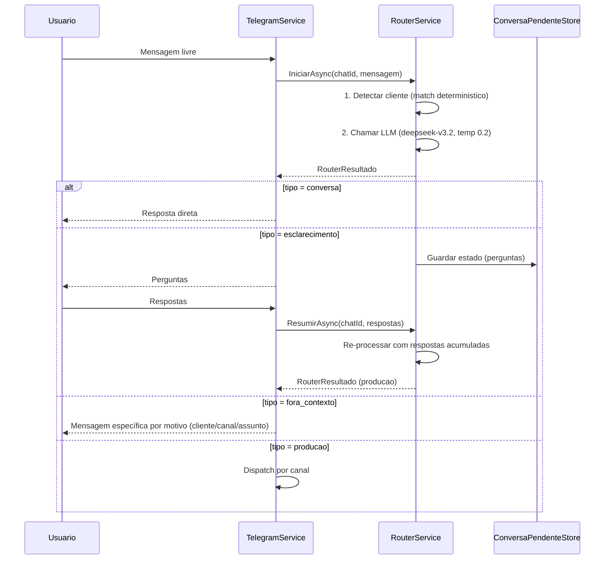
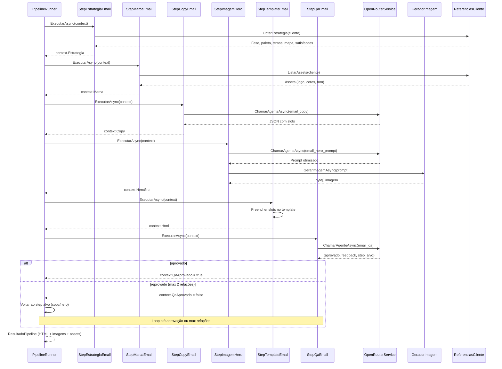
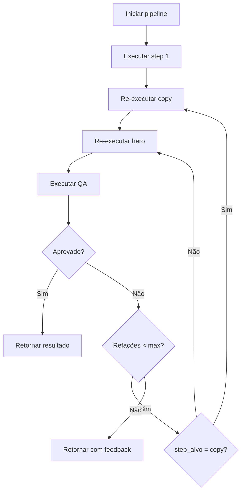
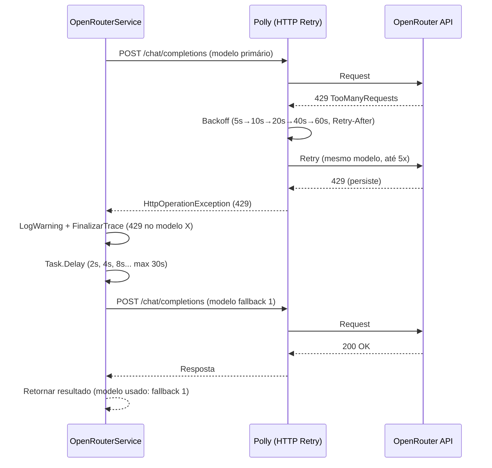
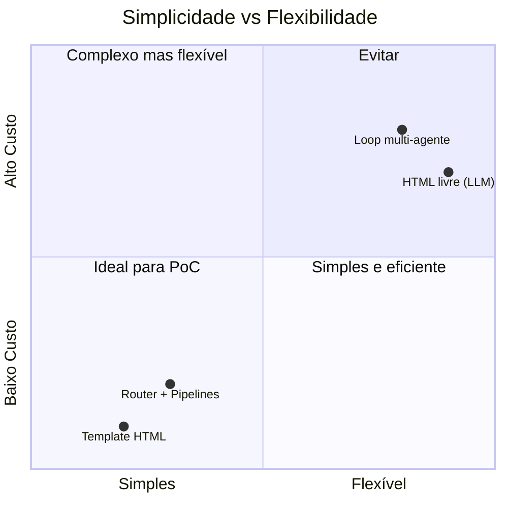

# Arquitetura - DemoAgencia

Documentação técnica da arquitetura do sistema DemoAgencia.

## Visão Geral

O DemoAgencia é uma Prova de Conceito (PoC) de um sistema de automação de marketing via Telegram, com pipeline de email marketing gerada por IA. A arquitetura evoluiu de um loop multi-agente para uma abordagem mais simples e determinística baseada em **Router + Pipelines**.

```mermaid
graph TB
    subgraph "Cliente"
        User[Usuário]
    end
    
    subgraph "Telegram"
        Bot[Telegram Bot API]
    end
    
    subgraph "DemoAgencia Worker"
        TS[TelegramService]
        RS[RouterService]
        PS[ConversaPendenteStore]
    PR[PipelineRunner]
    PE[PipelineEmail]
    SE[StepEstrategiaEmail]
    OR[OpenRouterService]
    LI[LangfuseInterceptor]
    RC[ReferenciaClienteLoader]
}
    
    subgraph "Servicos Externos"
        OR_API[OpenRouter API]
        LF[Langfuse]
        GL[Grafana Loki]
    end
    
    subgraph "Armazenamento"
        TPL[referencias/templates/*.html]
        REF[Referencias {cliente}_*]
        EST[Referencias/estrategia/*.json]
        LOG[Logs]
    end
    
    User -->|Mensagens| Bot
    Bot -->|Long Polling| TS
    TS -->|Router| RS
    RS -->|Pendencias| PS
    RS -->|Dispatch email| PR
    PR -->|Executa steps| PE
    PE -->|Estrategia| SE
    PE -->|Marca| RC
    PE -->|LLM| OR
    OR -->|API| OR_API
    OR -->|Traces| LI
    LI -->|Envia| LF
    SE -->|Le| RC
    RC -->|Le| REF
    RC -->|Le| EST
    TS -->|Logs| LOG
    LOG --> GL
```

## Router (Intake Único)

O RouterService substitui o antigo PipelinePreFlightService. Sua função é classificar a mensagem e estruturar o brief para pipelines de produção.



### Schema do Brief

```json
{
  "tipo": "producao",
  "cliente": "acme",
  "brief": {
    "canal": "email | instagram | landing",
    "objetivo": "vender | engajar | informar",
    "publico": "empresarios",
    "oferta": "Black Friday 50% off",
    "tom": "urgente",
    "link": "https://acme.com/promo",
    "etapa_jornada": "pos-compra | pre-chaves | pos-chaves",
    "sub_jornada": "Pos Financiamento",
    "restricoes": ["sem emojis", "max 200 palavras"],
    "imagens": [{"papel": "hero", "descricao": "Banner com produto"}]
  }
}
```

### Dispatch por Canal

| Canal | Handler | Status |
|-------|---------|--------|
| `email` | `PipelineEmail` | Implementado |
| `instagram` | PipelineInstagram | Planejado |
| `landing` | PipelineLanding | Planejado |

Canais não implementados são rejeitados pela guarda determinística do router como `fora_contexto` (motivo: `canal_nao_permitido`).

### Escopo Configurável

O router opera com escopo configurável via `PreFlightOptions`:
- `ClientesPermitidos` (default: `["mrv"]`)
- `CanaisPermitidos` (default: `["email"]`)

**Guarda determinística**: após a classificação do LLM, o RouterService valida se `cliente ∈ ClientesPermitidos` e `canal ∈ CanaisPermitidos`. Se não, coage o resultado para `fora_contexto` com motivo (`cliente_nao_permitido`, `canal_nao_permitido`). Isso é defense-in-depth: mesmo que o LLM ignore as regras do prompt, a guarda impede que a pipeline execute para clientes/canais não autorizados.

O prompt injetado pelo `MontarPrompt` lista apenas clientes/canais permitidos (não todos os registrados), e a estratégia do cliente só é injetada quando o cliente detectado é permitido.

## Pipeline de Email

A PipelineEmail é uma lista ordenada de steps executados deterministicamente pelo PipelineRunner. Cada step recebe apenas o contexto necessário.



### Steps da Pipeline Email

| Step | Tipo | Modelo | Descrição |
|------|------|--------|-----------|
| `StepEstrategiaEmail` | Retrieval determinístico | N/A | Carrega fase da jornada, paleta, temas, sub-jornada, mapa emocional e satisfações/insatisfações; seleciona template via ITemplateCatalogo |
| `StepMarcaEmail` | Retrieval determinístico | N/A | Carrega logo, cores, tom de voz do cliente |
| `StepCopyEmail` | LLM (few-shot) | `qwen/qwen3.7-plus` | Gera assunto, preheader, título, saudação, corpo, CTA, rodapé |
| `StepDiagramacaoEmail` | LLM + guarda determinística | `qwen/qwen3.7-plus` | Recebe copy + estratégia (cores/temas) + ícones disponíveis e gera seções HTML diagramadas (table-based, inline CSS). Guarda rejeita `<div>`/`<style>`/`<script>` e exige `<table>`. Fallback para corpo original se inválido |
| `StepImagemHero` | Retrieval + LLM (curador) + API | `qwen/qwen3.7-plus` (hero) + `deepseek/deepseek-v3.2` (curador) | Seleciona top-3 banners por afinidade; descreve cada um com visão (BannerDescricaoCache) e valida compatibilidade temática via agente curador (fail-open); primeiro compatível é anexado; nenhum compatível → gera hero via IA (prompt do brief ou default); em refação QA → pula seleção e regenera direto |
| `StepTemplateEmail` | Template + slots | N/A | Resolve template via ITemplateCatalogo (context.TemplateId ou default); preenche HTML table-based com slots |
| `StepAssetsEmail` | Retrieval determinístico | N/A | Resolve referências `assets/...` no HTML final contra o banco de assets do cliente e as empacota |
| `StepQaEmail` | LLM (branch explícito) | `deepseek/deepseek-r1-0528` | Avalia entregável; retorna `step_alvo` se reprovar |

### Contexto por Step

Cada step recebe apenas o contexto necessário (princípio do mínimo privilégio):

| Step | Recebe | Não recebe |
|------|--------|------------|
| `StepEstrategiaEmail` | Cliente, Brief.etapa_jornada, banco de estratégias, ITemplateCatalogo | Brief restante, outros steps |
| `StepMarcaEmail` | Cliente, banco de referências | Brief, Estrategia, outros steps |
| `StepCopyEmail` | Brief fields + Marca + Estrategia | Outros steps, histórico |
| `StepDiagramacaoEmail` | Copy + Estrategia (cores/temas) + ícones disponíveis | Outros steps, histórico |
| `StepImagemHero` | Brief.imagens + Marca + Estrategia (paleta) + ITemplateCatalogo (sub-jornadas) + BannerDescricaoCache | Outros steps |
| `StepTemplateEmail` | Copy slots + Hero src + Banner src + Marca | Brief, outros steps |
| `StepAssetsEmail` | HTML final + banco de referências | Brief, outros steps |
| `StepQaEmail` | Brief original + HTML final + Estrategia + Banner src | Few-shots, outros steps |

## Template HTML

Os templates HTML são table-based para compatibilidade com clientes de email (Outlook, Gmail, etc.). Múltiplos templates podem coexistir em `Assets/referencias/templates/`, cada um com um sidecar JSON de afinidade (cliente, fase, sub-jornadas, palavras-chave). O `StepEstrategiaEmail` seleciona o template mais afim ao pedido do cliente via `ITemplateCatalogo`.

### Estrutura de um Template

Cada template tem uma estrutura fixa (banner, saudação, despedida, rodapé) com placeholders `{{...}}` para conteúdo dinâmico:

```html
<!-- Estrutura principal -->
<table width="600">
  <tr><td>{{banner_section}}</td></tr>  <!-- Condicional: banner de referência da etapa ou vazio -->
  {{hero_section}}  <!-- Condicional: imagem hero gerada pela IA (quando sem banner) -->
  <tr><td>Olá, %%NOME%%!</td></tr>  <!-- Saudação fixa, placeholder do cliente -->
  <tr><td>{{corpo}}</td></tr>        <!-- Conteúdo dinâmico gerado pela IA -->
  <tr><td><a href="{{cta_link}}">{{cta_texto}}</a></td></tr>
  <tr><td><!-- Despedida fixa --></td></tr>
  <tr><td><!-- Rodapé fixo --></td></tr>
</table>
```

### Sidecar JSON de Afinidade

Cada template `MRV_html_exemplo.html` pode ter um `MRV_html_exemplo.json`:

```json
{
  "cliente": "mrv",
  "fase": "pos-chaves",
  "sub_jornadas": ["assistencia", "visita-tecnica"],
  "palavras_chave": ["visita tecnica", "reparo"],
  "padrao": false
}
```

### Seleção de Template

O `TemplateCatalogo` carrega todos os templates e sidecars. A seleção é determinística:
1. Filtra por cliente (fallback: templates sem restrição ou default)
2. Score: fase (+10), sub-jornada (+5), palavras-chave (+1 por match)
3. Fallback: `padrao: true` ou primeiro alfabético

### Placeholders

- **Pipeline**: `{{assunto}}`, `{{preheader}}`, `{{titulo}}`, `{{saudacao}}`, `{{corpo}}` (HTML cru), `{{cta_link}}`, `{{cta_texto}}`, `{{logo_src}}`, `{{rodape}}`, `{{banner_section}}`, `{{banner_src}}`, `{{hero_section}}`, `{{hero_src}}`
- **Cliente (passam direto)**: `%%NOME%%`, `%%Protocolo%%`, `%%Imovel%%`, `%%Pedido%%`, `%%tempo%%` — preenchidos pelo ESP do cliente

### Características do Template

- **Table-based layout**: Compatível com Outlook, Gmail, Apple Mail
- **CSS inline**: Cada tag tem `style=""` explícito
- **Ghost tables**: `<!--[if mso]>` para Outlook
- **Imagens**: `` com `alt`, `border="0"`, `style="display: block;"`
- **Max-width 600px**: Padrão de email marketing
- **CTA bulletproof**: Botão como tabela, não `<a>` com background
- **Hero section**: Condicional (`{{hero_section}}` preenchido ou vazio)
- **Banner section**: Condicional (`{{banner_section}}` preenchido com banner da etapa ou vazio; quando presente, hero é suprimido)
- **Empacotamento de assets**: `StepAssetsEmail` resolve referências `assets/...` no HTML contra o banco de referências e as inclui no zip final
- **HTML escaping**: Slots de texto escapados via `WebUtility.HtmlEncode`

### Testes HTML (TDD)

O `StepTemplateEmail` tem 11 testes unitários cobrindo:

1. **Preenchimento de slots**: Todos os placeholders substituídos
2. **Estrutura table**: Zero `<div>`, apenas `<table>`
3. **Ghost tables**: Presença de `<!--[if mso]>`
4. **CSS inline**: Presença de `style=""`
5. **Imagens**: `alt`, `border="0"`, `display: block`
6. **Max-width**: `max-width: 600px`
7. **CTA bulletproof**: Tabela ao redor do link
8. **Hero condicional**: Presente quando `hero_src` definido, ausente quando nulo
9. **HTML escaping**: Caracteres especiais escapados (`&lt;`, `&amp;`, `&quot;`)
10. **Resultado final**: `ResultadoPipeline.RespostaFinal` = HTML completo
11. **Logo**: `logo_src` preenchido corretamente

## PipelineRunner

O PipelineRunner executa uma lista ordenada de steps com suporte a QA retry loop:

```csharp
public class PipelineRunner
{
    public async Task<ResultadoPipeline> ExecutarAsync(
        PipelineContext context,
        IReadOnlyList<IPipelineStep> steps,
        int maxRefacoesQa,
        Func<string, Task>? onProgresso,
        CancellationToken ct)
    {
        // Executa steps em ordem
        // Se QA reprova, volta ao step alvo (copy/hero)
        // Max refações = maxRefacoesQa (default 2)
        // Retorna ResultadoPipeline (HTML + imagens + assets)
    }
}
```

### QA Retry Loop



## Resiliência HTTP e Tratamento de 429

O sistema implementa retry em camadas para erros HTTP, com tratamento específico para 429 (Too Many Requests / rate limit):

### Camadas de Retry

| Camada | Mecanismo | Escopo | Comportamento |
|--------|-----------|--------|---------------|
| **1 — HTTP (Polly)** | `Microsoft.Extensions.Http.Resilience` | Cliente "OpenRouter" | Retenta 408/429/5xx + erros transitórios; backoff exponencial 5s→60s; respeita header `Retry-After` |
| **2 — Fallback de modelo** | Loop em `OpenRouterService` | `ChamarAgenteAsync`, `GerarImagemAsync` | 429 persistente após Polly: troca para próximo modelo da cadeia com backoff 2s→30s |
| **3 — Semântico** | `RouterService` | Router (JSON inválido) | 1 retry automático com prompt reforçado |
| **4 — Negócio** | `PipelineRunner` | QA | Max 2 refações no step alvo (copy/hero) |
| **5 — Reconexão** | `TelegramService` | Polling loop | Backoff exponencial 1s→30s em perda de conexão |

### Fluxo 429



### Configuração

| Variável | Default | Descrição |
|----------|---------|-----------|
| `OpenRouter__MaxRetriesHttp` | `5` | Tentativas do Polly por modelo |
| `OpenRouter__BackoffBaseSegundos` | `5` | Base do backoff exponencial do Polly |
| `OpenRouter__BackoffMaxSegundos` | `60` | Teto do backoff do Polly |
| `OpenRouter__FallbackModels` | `deepseek/deepseek-v3.2,qwen/qwen3.7-plus,openai/gpt-4o-mini` | Cadeia de fallback para chamadas de texto (vírgula-separada) |
| `OpenRouter__ImageFallbackModels` | _(vazio)_ | Cadeia de fallback para geração de imagem |
| `OpenRouter__Backoff429BaseSegundos` | `2` | Base do backoff entre trocas de modelo |
| `OpenRouter__Backoff429MaxSegundos` | `30` | Teto do backoff entre trocas de modelo |

### Observabilidade

Cada tentativa gera um trace no Langfuse com o modelo efetivamente usado. Falhas 429 registram o erro no trace antes da troca de modelo. Isso permite rastrear no Langfuse quantas trocas ocorreram e qual modelo foi usado no resultado final.

### Recomendação de Tuning

Com Polly re-tryando 429 (até 5×, ~135s no pior caso) **e** fallback depois (até 3 modelos adicionais), o tempo total pode ser longo. Para reduzir latência máxima, configure `OpenRouter__MaxRetriesHttp=2` quando fallback de modelos está ativo. Isso troca latência por cobertura: menos retries no mesmo modelo, mais modelos tentados.

## Observabilidade

### Langfuse Traces

Cada step LLM gera um trace no Langfuse com etapa nomeada:

| Etapa | Descrição | Modelo |
|-------|-----------|--------|
| `router` | Classificação + estruturação do brief | `deepseek/deepseek-v3.2` |
| `router_retry` | Retry do router (JSON inválido) | `deepseek/deepseek-v3.2` |
| `email_copy` | Geração de copy (assunto, corpo, CTA) | `qwen/qwen3.7-plus` |
| `email_diagramacao` | Geração de seções HTML diagramadas para o corpo | `qwen/qwen3.7-plus` |
| `email_hero_prompt` | Geração de prompt para imagem hero | `qwen/qwen3.7-plus` |
| `email_banner_check` | Validação de compatibilidade temática banner×email | `deepseek/deepseek-v3.2` |
| `email_hero_imagem` | Chamada de API de geração de imagem | (API call) |
| `email_qa` | Avaliação de qualidade | `deepseek/deepseek-r1-0528` |
| `image-analysis` | Análise de imagem enviada pelo usuário | `qwen/qwen2.5-vl-72b-instruct` |
| `banner-analysis` | Análise estruturada de banner (BannerDescricao) | `qwen/qwen2.5-vl-72b-instruct` |
| `image-generation` | Geração de imagem via API | `qwen/qwen-image-3-pro` |

Steps determinísticos (estrategia, marca, template, assets) não geram traces LLM, apenas logs Serilog.

### Grafana Loki

Todos os steps logam via Serilog para Grafana Loki:

```
[StepMarcaEmail] Cliente=acme, Assets=3, Logo=true
[StepCopyEmail] Modelo=qwen3.7-plus, Tokens=1200
[StepTemplateEmail] Slots=11, HeroIncluded=true
[StepQaEmail] Aprovado=true, Feedback="Copy clara e persuasiva"
```

### Reasoning Disabling

Etapas com prefixo `router` desabilitam reasoning do modelo (otimização de custo/latência):

```csharp
var desativarRaciocinio = etapaNome.StartsWith("router", StringComparison.OrdinalIgnoreCase);
ReasoningDisablingHandler.IsActive = desativarRaciocinio;
```

## Estrutura do Projeto

```
src/DemoAgencia.Worker/
├── Program.cs                          # Configuração DI + Serilog
├── ServiceCollectionExtensions.cs      # Composição DI
│
├── Telegram/
│   ├── TelegramService.cs              # Long polling + handlers
│   ├── ITelegramGateway.cs             # Interface para Telegram Bot
│   ├── TelegramBotGateway.cs           # Implementacao real + TelegramGatewayFactory
│   ├── TelegramMessageSplitter.cs      # Divisão de mensagens longas
│   └── TelegramTextFormatter.cs        # Formatação de texto
│
├── IA/
    │   ├── Router/
    │   │   ├── RouterService.cs            # Intake + classificação
    │   │   ├── RouterParser.cs             # Parse JSON do router
    │   │   └── Brief.cs                    # Modelo do brief estruturado
    │   │
    │   ├── Pipelines/
    │   │   ├── IPipelineStep.cs            # Interface de step
    │   │   ├── PipelineContext.cs          # Contexto compartilhado
    │   │   ├── PipelineRunner.cs           # Executor de pipeline
    │   │   ├── StepRecords.cs              # Records (MarcaEmail, CopyEmailSlots)
    │   │   ├── EstrategiaEmail.cs          # Contexto de estratégia por fase
    │   │   │
    │   │   └── Email/
    │   │       ├── PipelineEmail.cs        # Composição da pipeline email
    │   │       ├── StepEstrategiaEmail.cs  # Retrieval de estratégia
    │   │       ├── StepMarcaEmail.cs       # Retrieval de marca
    │   │       ├── StepCopyEmail.cs        # LLM copy
    │   │       ├── StepDiagramacaoEmail.cs # LLM diagramação HTML + guarda
    │   │       ├── StepImagemHero.cs       # LLM prompt + API imagem
    │   │       ├── StepTemplateEmail.cs    # Template HTML slots
    │   │       ├── StepAssetsEmail.cs      # Resolução de assets referenced
    │   │       └── StepQaEmail.cs          # QA com branch explícito
    │   │
    │   ├── BannerDescricao.cs              # Record estruturado para análise visual
    │   ├── BannerDescricaoCache.cs         # Cache com sidecar JSON
    │   ├── OpenRouterService.cs            # LLM + API imagem + visão via OpenRouter
    │   ├── IServicoChat.cs                 # Interface para LLM
    │   ├── IGeradorImagem.cs               # Interface para geração de imagem
    │   ├── IAnalisadorImagem.cs            # Interface para análise de imagem
    │   ├── IBannerDescricaoCache.cs        # Interface para cache de descrições
    │   ├── JsonHelper.cs                   # Utilitário para extração de JSON
    │   └── ResultadoPipeline.cs            # Resultado final (HTML + imagens + assets)
│
├── Referencias/
│   ├── IReferenciasCliente.cs          # Interface para referências
│   ├── ReferenciaClienteLoader.cs      # Loader de referências + estratégia
│   ├── AssetVisual.cs                  # Modelo de asset visual
│   ├── EstrategiaCliente.cs            # Modelos de estratégia de jornada
│   └── FaseJornada.cs                  # Chaves canônicas de fase + normalizador
│
├── Configuracoes/
│   ├── OpenRouterOptions.cs            # Config OpenRouter
│   ├── TelegramOptions.cs              # Config Telegram
│   ├── PreFlightOptions.cs             # Config router (max rodadas)
│   └── SegurancaOptions.cs             # Config segurança
│
├── Seguranca/
│   ├── AnonimizadorService.cs          # Anonimização de dados sensíveis
│   └── RateLimiterService.cs           # Rate limiting
│
├── Observabilidade/
│   ├── LangfuseInterceptor.cs          # Interceptor para Langfuse
│   └── LangfuseClient.cs               # HTTP client para Langfuse
│
├── Contracts/
│   ├── LangfuseTrace.cs                # Modelo de trace
│   └── LangfuseTraceContext.cs         # Contexto de trace
```

## Modelo de Dados

### Brief

```csharp
public record Brief(
    string Canal,           // email | instagram | landing
    string? Objetivo,       // vender | engajar | informar
    string? Publico,        // Descrição do público-alvo
    string? Oferta,         // Produto/serviço em oferta
    string? Tom,            // Tom de voz desejado
    string? Link,           // URL do CTA
    List<string> Restricoes,// Restrições adicionais
    List<ImagemBrief> Imagens, // Imagens a gerar (papel + descrição)
    string? EtapaJornada,   // pos-compra | pre-chaves | pos-chaves (quando cliente tem estratégia)
    string? SubJornada      // Sub-jornada específica (quando aplicável)
);

public record ImagemBrief(string Papel, string Descricao);
```

### RouterResultado

```csharp
public record RouterResultado(
    string Tipo,            // conversa | esclarecimento | producao | fora_contexto
    string? Resposta,       // Resposta direta (conversa)
    List<string> Perguntas, // Perguntas de esclarecimento
    string? Cliente,        // Cliente identificado
    Brief? Brief            // Brief estruturado (producao)
);
```

### PipelineContext

```csharp
public class PipelineContext
{
    public long ChatId { get; init; }
    public Brief Brief { get; init; } = null!;
    public string MensagemOriginal { get; init; } = string.Empty;
    public string? Cliente { get; init; }
    
    public EstrategiaEmail? Estrategia { get; set; }
    public MarcaEmail? Marca { get; set; }
    public string? LogoSrc { get; set; }
    public CopyEmailSlots? Copy { get; set; }
    public string? HeroSrc { get; set; }
    public string? Html { get; set; }
    
    public string? QaFeedback { get; set; }
    public string? QaStepAlvo { get; set; }
    public bool QaAprovado { get; set; }
    public int Refacoes { get; set; }
    
    public ResultadoPipeline Resultado { get; } = new();
}
```

## Decisões de Arquitetura

| Decisão | Justificativa | Alternativas consideradas |
|---------|---------------|---------------------------|
| Router + Pipelines (ao invés de loop multi-agente) | Elimina "telefone sem fio", reduz custo de coordenação, contexto mínimo por step | Loop de orquestração (8 agentes conversando) |
| Steps determinísticos (ao invés de agentes decidindo ordem) | Ordem conhecida em design-time, previsível, testável | Agentes decidindo ordem em runtime |
| Template HTML table-based (ao invés de HTML livre) | Compatibilidade com Outlook/Gmail, testável, previsível | LLM gerando HTML livre (16k tokens, bugs de layout) |
| QA com branch explícito (ao invés de loop de conversa) | Retry determinístico ao step alvo, max refações | QA conversando com outros agentes |
| Contexto mínimo por step | Cada step recebe só o necessário (marca, brief, step anterior) | Contexto compartilhado gigante (todos os steps) |
| Single Router (ao invés de Refinador + Montador) | Uma única LLM call classifica + estrutura brief | Duas LLM calls (refinador + montador) |
| Polly + fallback de modelos (ao invés de retry infinito no mesmo modelo) | 429 persistente troca de modelo; Polly honra Retry-After | Retry infinito no mesmo modelo rate-limited |

## Trade-offs

### Simplicidade vs Flexibilidade



## Evolução Futura

```mermaid
roadmap
    title Evolução do DemoAgencia
    section PoC (Atual)
    Router + Pipeline Email :done, 2026-10, 2026-10
    Template HTML table-based :done, 2026-10, 2026-10
    QA com retry :done, 2026-10, 2026-10
    
    section Próximos Passos
    Pipeline Instagram :2026-11, 2026-12
    Pipeline Landing :2027-01, 2027-02
    A/B testing de copy :2027-02, 2027-03
    
    section Produção
    Integração com CRM :2027-03, 2027-04
    Analytics de conversão :2027-04, 2027-05
    Multi-tenant :2027-05, 2027-06
```

## Referências

- [RUNBOOK.md](../RUNBOOK.md) - Guia de deploy e operação
- [CHECKLIST.md](../CHECKLIST.md) - Checklist de aceite E2E
- [README.md](../README.md) - Visão geral do projeto
