# Arquitetura - DemoAgencia

Documentação técnica da arquitetura do sistema DemoAgencia.

## Visão Geral

O DemoAgencia é uma Prova de Conceito (PoC) de um sistema multi-agente de IA operando via Telegram, com orquestração inteligente e pipeline de produção com controle de qualidade.

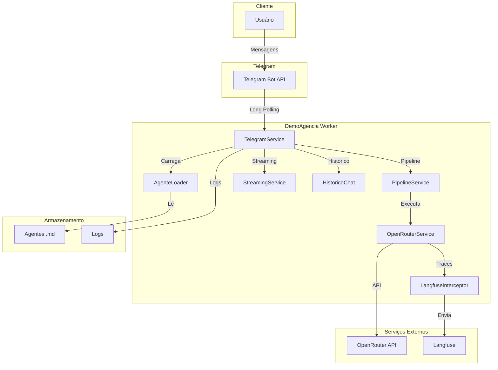

## Pipeline Multi-Agente

O sistema utiliza um pipeline multi-agente com orquestração inteligente:

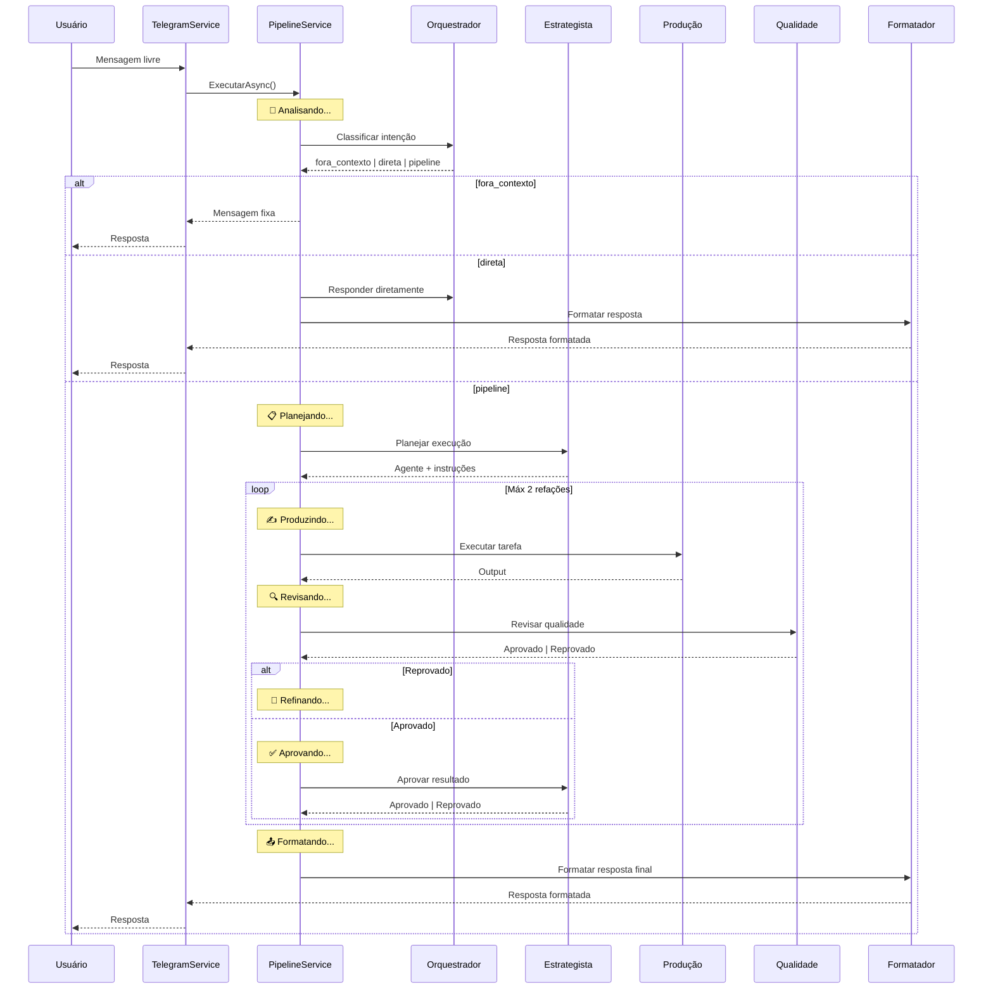

### Papéis dos Agentes

| Papel | Descrição | Exemplos |
|-------|-----------|----------|
| **orquestrador** | Classifica intenção e decide rota | Orquestrador |
| **estrategista** | Planeja execução e aprova resultados | Estrategista |
| **producao** | Executa tarefas específicas | Redator, Dev, Editor de Imagens |
| **qualidade** | Revisa output dos agentes de produção | Qualidade |
| **formatacao** | Formata resposta final para o usuário | Formatador |

### Rotas do Orquestrador

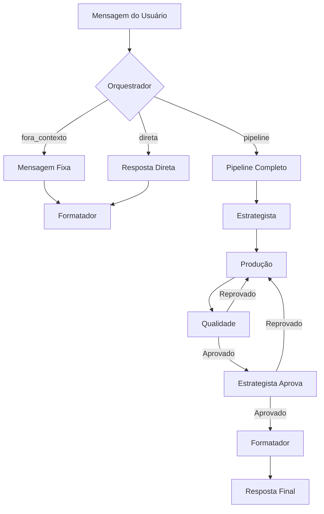

## Diagrama de Componentes

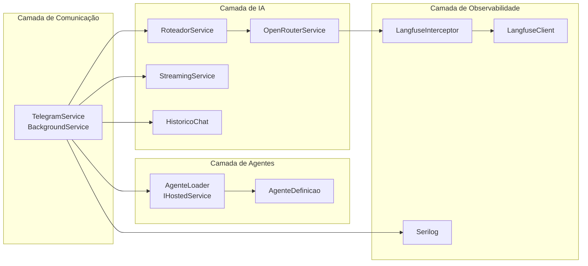

## Fluxo de Mensagem

### Fluxo Principal (Texto)

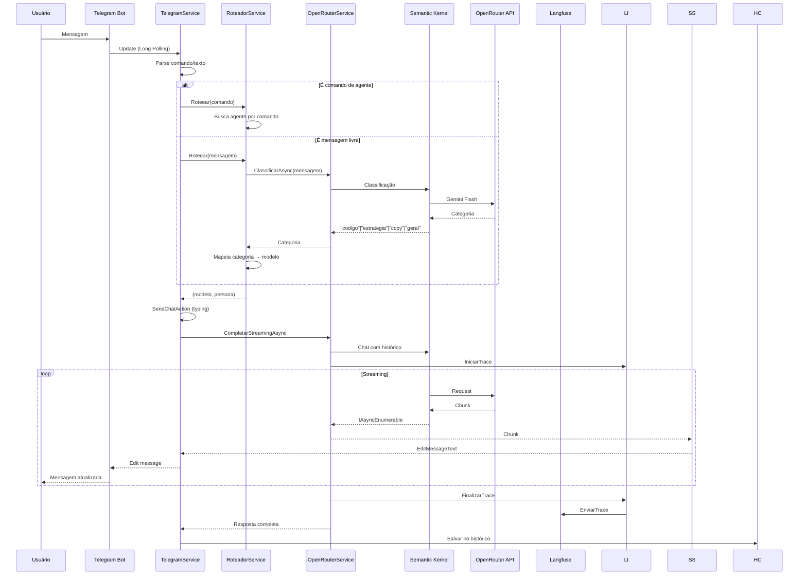

### Fluxo de Imagem (Análise)

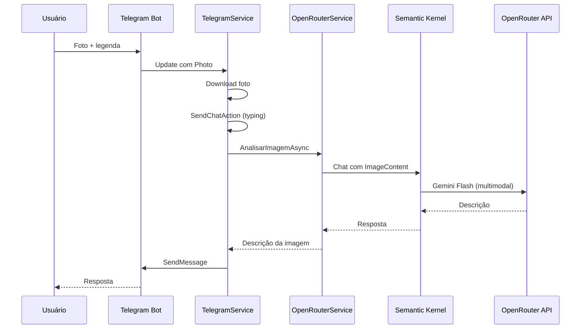

### Fluxo de Geração de Imagem

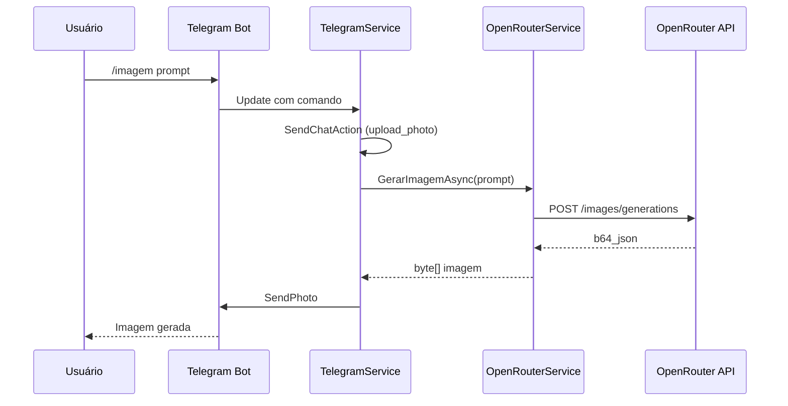

## Roteamento de Modelos

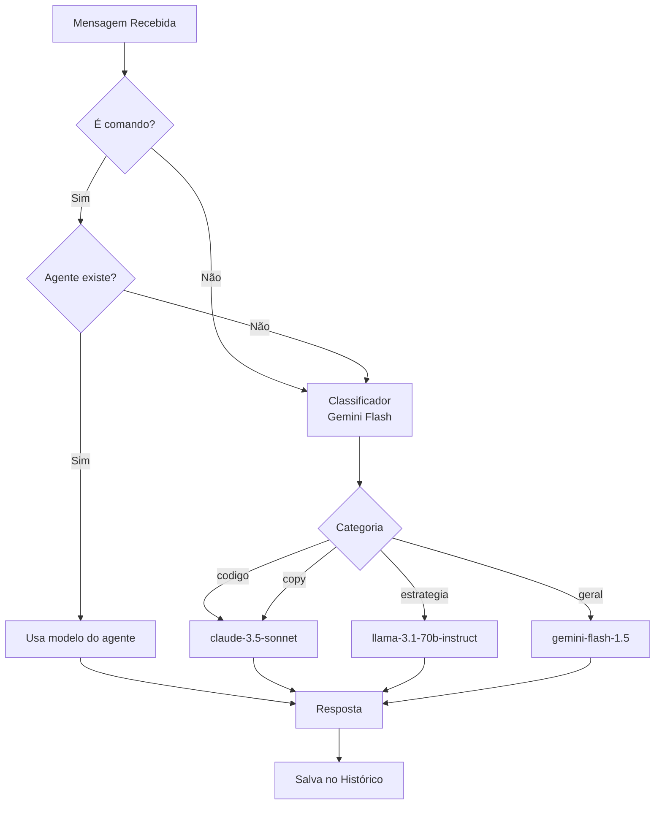

## Estrutura do Projeto

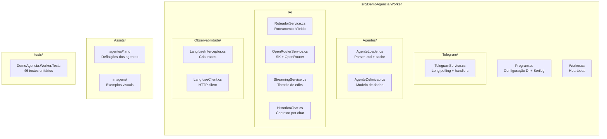

## Diagrama de Deploy

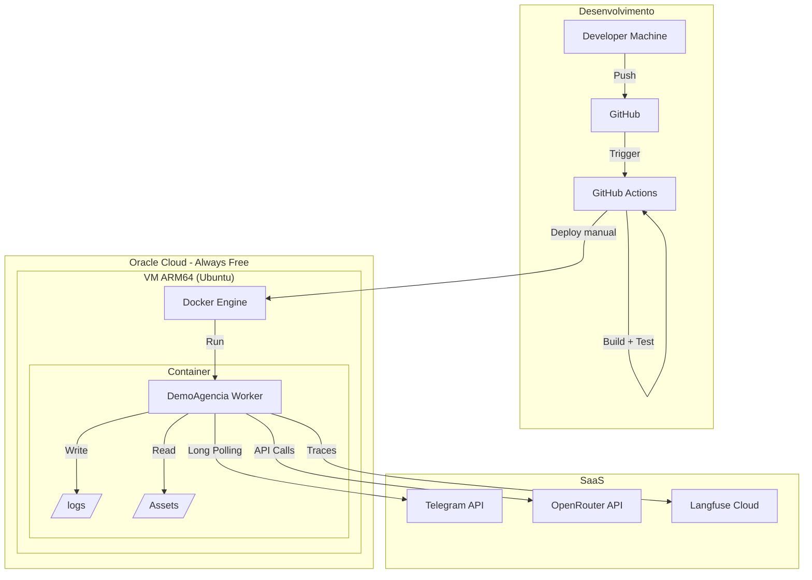

## Ciclo de Vida do Agente

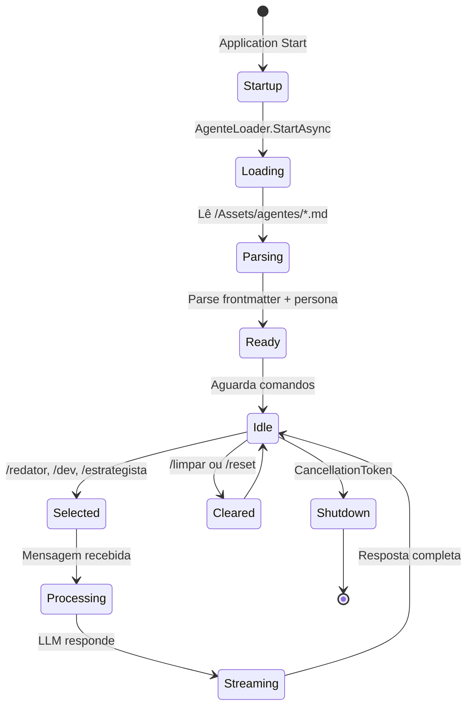

## Modelo de Dados

### AgenteDefinicao

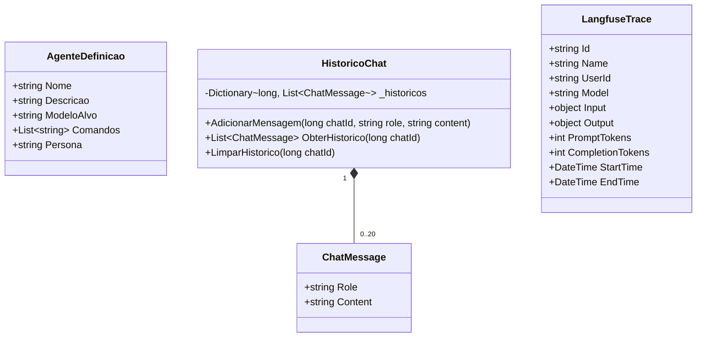

## Fluxo de Observabilidade

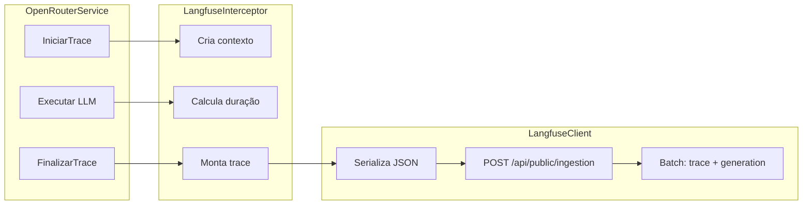

## Decisões de Arquitetura

| Decisão | Justificativa | Alternativas consideradas |
|---------|---------------|---------------------------|
| Worker Service (BackgroundService) | Simplicidade, sem necessidade de web server | ASP.NET Core minimal API, Console App |
| Long Polling | Não requer webhooks, sem abertura de portas | Webhooks (requer IP público fixo) |
| OpenRouter | Acesso a múltiplos modelos com uma API | APIs diretas (mais custo, mais complexidade) |
| Semantic Kernel | Orquestração nativa Microsoft, filtros | LangChain (Python), implementação manual |
| Markdown para agentes | Legível, versionável, sem DB | YAML, JSON, banco de dados |
| In-Memory para histórico | PoC, sem estado persistente | Redis, SQLite, PostgreSQL |
| Serilog + arquivo | Simplicidade, rotação automática | ELK Stack, Seq, Application Insights |
| Langfuse Cloud (free) | LLMOps sem custo inicial | Self-hosted Langfuse, custom dashboard |
| Docker ARM64 | Aproveita Oracle Free Tier ARM | x86_64 (mais caro), bare metal |
| Streaming com throttle | UX melhorada respeitando rate limits | Resposta única, streaming sem throttle |

## Trade-offs

### Custo vs Complexidade

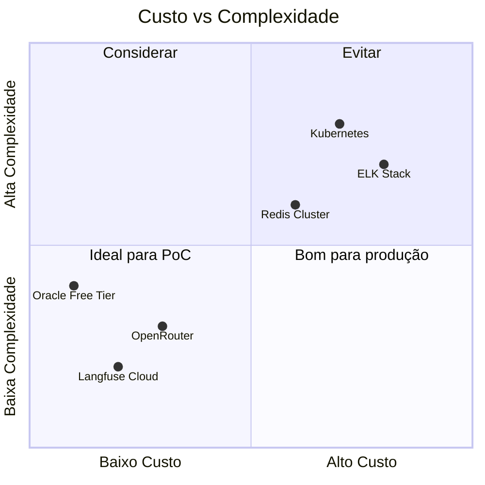

## Evolução Futura

```mermaid
roadmap
    title Evolução do DemoAgencia
    section PoC (Atual)
    Worker Service :done, 2024-01, 2024-02
    Telegram Bot :done, 2024-01, 2024-02
    Agentes .md :done, 2024-01, 2024-02
    OpenRouter :done, 2024-02, 2024-03
    Langfuse :done, 2024-02, 2024-03
    
    section MVP
    Banco de dados :2024-04, 2024-05
    Autenticação :2024-04, 2024-05
    Multi-tenant :2024-05, 2024-06
    
    section Produção
    Kubernetes :2024-07, 2024-09
    Monitoramento avançado :2024-07, 2024-08
    Auto-scaling :2024-08, 2024-10
```

## Referências

- [arquitetura.json](../arquitetura.json) - Especificação original do projeto
- [RUNBOOK.md](../RUNBOOK.md) - Guia de deploy e operação
- [CHECKLIST.md](../CHECKLIST.md) - Checklist de aceite E2E
