# Arquitetura - DemoAgencia

Documentação técnica da arquitetura do sistema DemoAgencia.

## Visão Geral

O DemoAgencia é uma Prova de Conceito (PoC) de um sistema multi-agente de IA operando via Telegram, com orquestração inteligente e pipeline de produção com controle de qualidade.

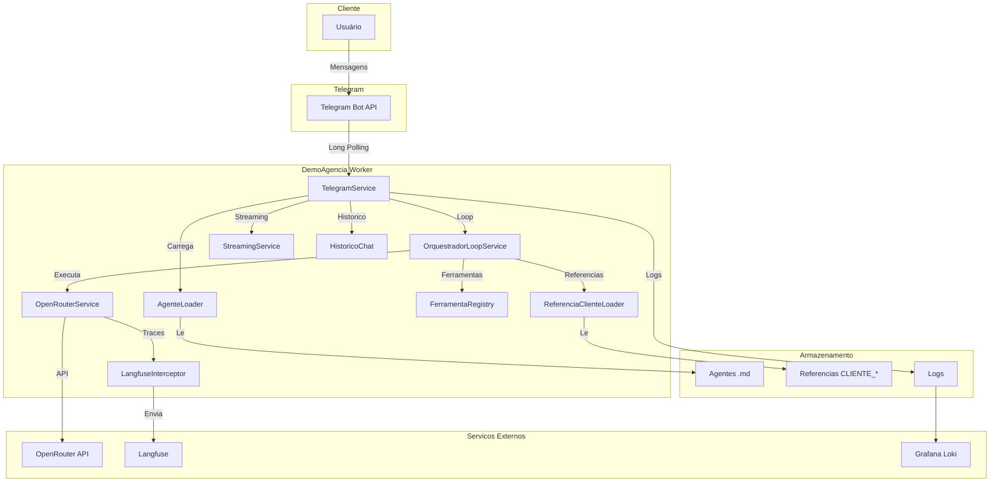

## Orquestrador Loop (Supervisor)

O sistema utiliza um **loop de orquestracao** (padrao supervisor/hub-and-spoke) onde o orquestrador decide a cada turno qual acao executar:

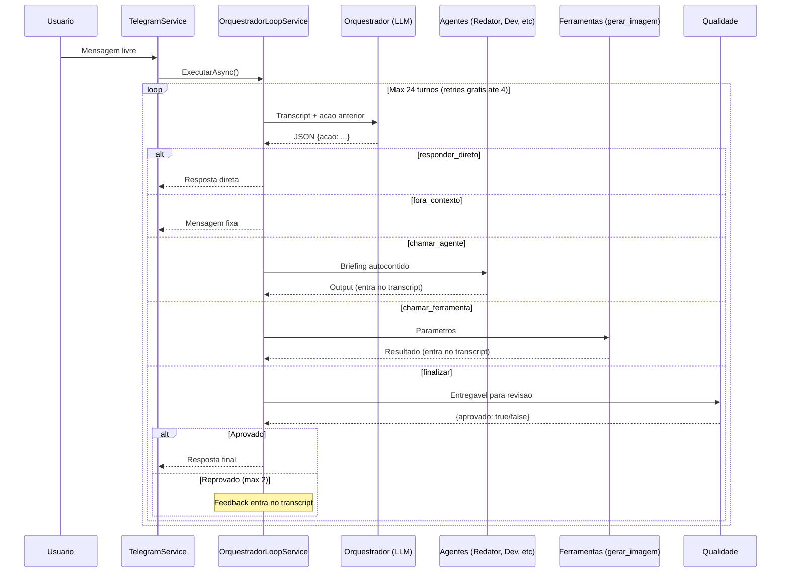

### Acoes do Orquestrador

| Acao | Descricao |
|------|-----------|
| `responder_direto` | Resposta direta a perguntas simples |
| `fora_contexto` | Mensagem fora do escopo de Marketing |
| `chamar_agente` | Delega a um agente especializado (Redator, Dev, etc) |
| `chamar_ferramenta` | Usa uma ferramenta (gerar_imagem) |
| `finalizar` | Entregavel pronto → QA obrigatorio → entrega |

### Papeis dos Agentes

| Papel | Descricao | Exemplos |
|-------|-----------|----------|
| **orquestrador** | Loop supervisor, decide acoes e costura contexto | Orquestrador |
| **producao** | Executa tarefas especificas | Redator, Dev, Estrategista, Prompt para Imagens |
| **qualidade** | Revisor critico independente de qualquer entregavel | Qualidade |

### Ferramentas

Ferramentas sao registradas em codigo e chamadas pelo orquestrador via `chamar_ferramenta`:

| Ferramenta | Descricao |
|------------|-----------|
| `gerar_imagem` | Gera imagem a partir de prompt; suporta `legenda` e `assets: [ids]` para identidade visual |
| `listar_assets` | Lista assets visuais (header, footer, icon, logo, foto, post) de um cliente |
| `anexar_asset` | Anexa um asset pre-existente ao resultado final para envio ao usuario |

Novas ferramentas = novo `.cs` implementando `IFerramenta` + registro no `FerramentaRegistry`.

### Referencias de Cliente

O sistema suporta carregar referencias de clientes (manuais de marca, exemplos, imagens) para personalizar a producao. As referencias ficam em `Assets/referencias/` com o padrao `CLIENTE_{nome}_{tipo}.ext`.

**Fluxo de referencias:**

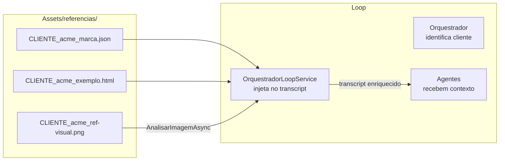

**Como funciona:**

1. **Orquestrador** identifica o cliente na mensagem (campo `cliente` no JSON)
2. **Loop** carrega as referencias de texto (JSON, HTML, MD) e analisa imagens on-demand
3. **Loop** injeta as referencias no transcript do orquestrador
4. **Orquestrador** usa o contexto enriquecido ao chamar agentes de producao

**Configuracao (appsettings.json):**

```json
{
  "Loop": {
    "MaxTurnos": 24,
    "MaxRefacoesQa": 2,
    "MaxRetriesGratis": 4,
    "MensagemForaContexto": "...",
    "MensagemFalha": "..."
  },
  "Pipeline": {
    "Referencias": {
      "MaxCharsPorArquivo": 4000
    }
  }
}
```

**Extensões suportadas:**
- Texto: `.json`, `.html`, `.htm`, `.md`, `.txt`, `.css`
- Imagem: `.png`, `.jpg`, `.jpeg`, `.gif`, `.webp`

### Fluxo do Loop

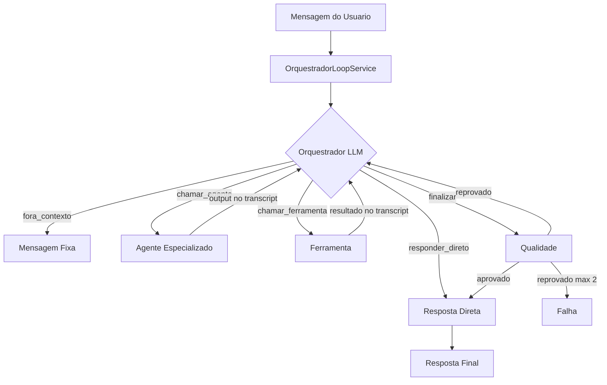

## Diagrama de Componentes

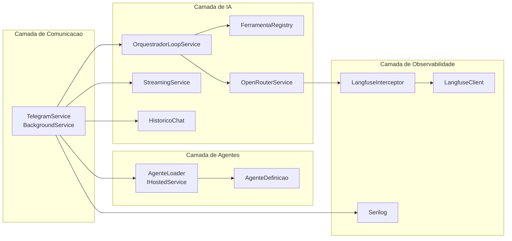

## Fluxo de Mensagem

### Fluxo Principal (Comando de Agente)

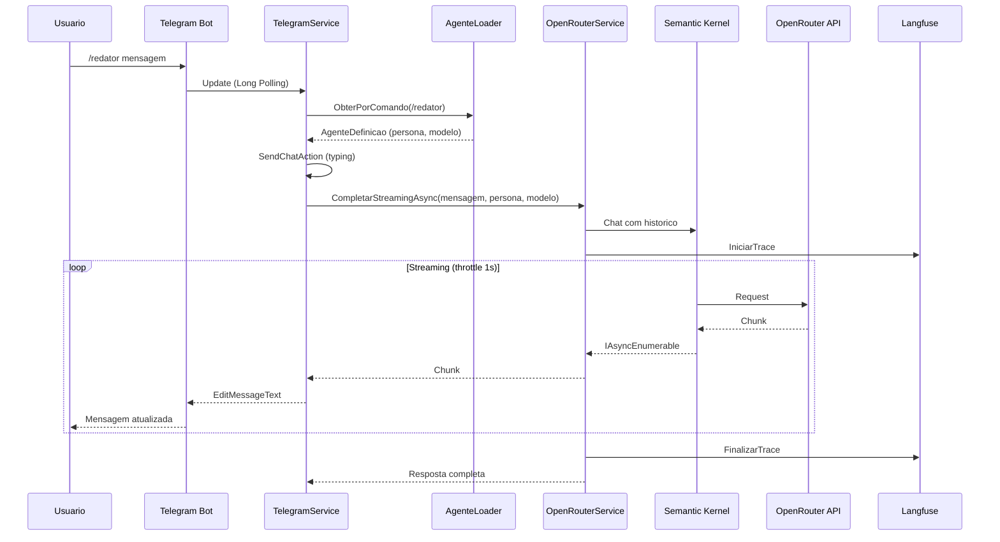

### Fluxo Principal (Mensagem Livre - Loop)

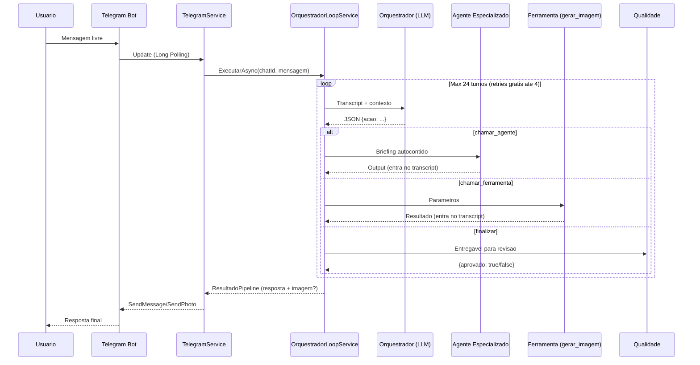

### Fluxo de Imagem (Analise)

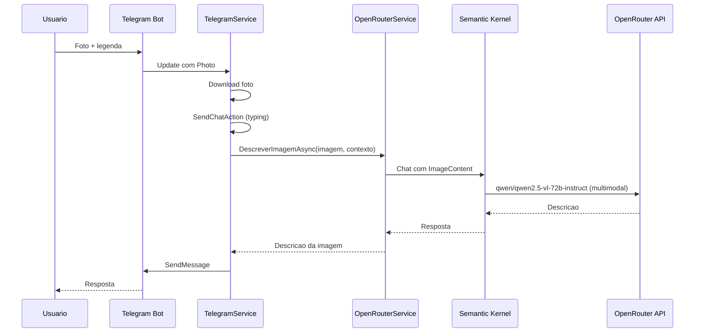

### Fluxo de Geracao de Imagem (via Ferramenta)

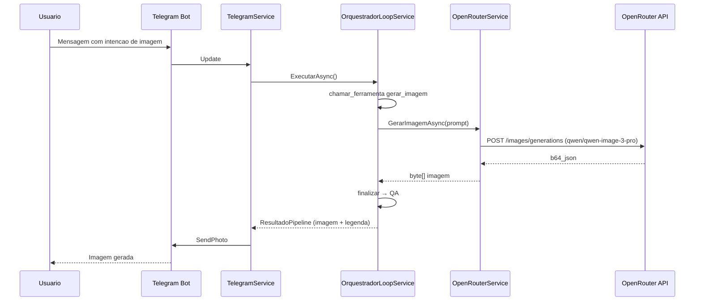

## Estrutura do Projeto

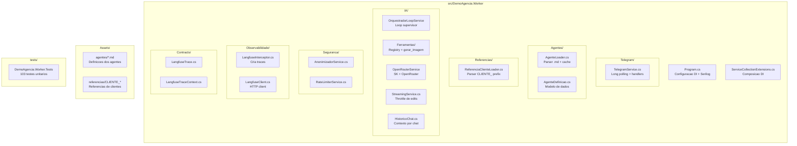

## Diagrama de Deploy

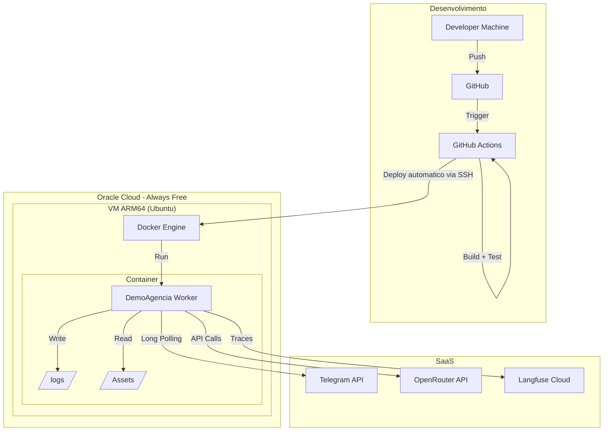

## Ciclo de Vida do Agente

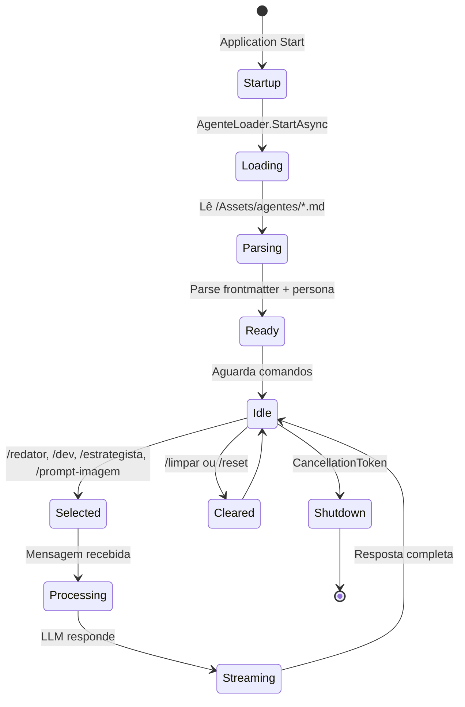

## Modelo de Dados

### AgenteDefinicao

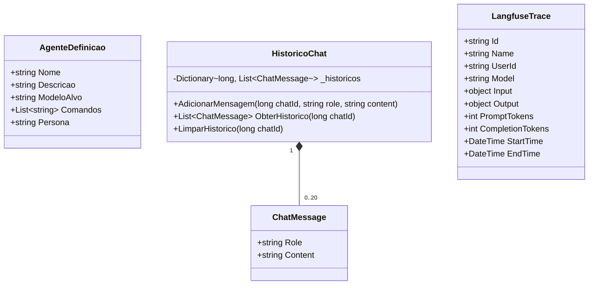

## Fluxo de Observabilidade

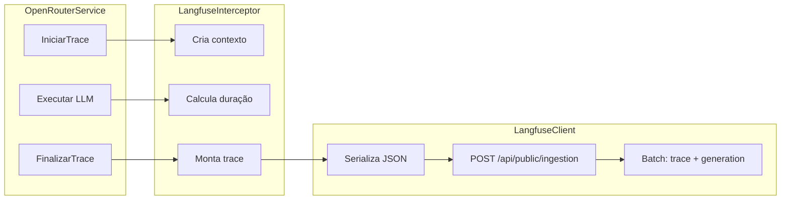

## Decisões de Arquitetura

| Decisão | Justificativa | Alternativas consideradas |
|---------|---------------|---------------------------|
| Worker Service (BackgroundService) | Simplicidade, sem necessidade de web server | ASP.NET Core minimal API, Console App |
| Long Polling | Não requer webhooks, sem abertura de portas | Webhooks (requer IP público fixo) |
| OpenRouter | Acesso a múltiplos modelos com uma API | APIs diretas (mais custo, mais complexidade) |
| Semantic Kernel | Orquestração nativa Microsoft, filtros | LangChain (Python), implementação manual |
| Markdown para agentes | Legível, versionável, sem DB | YAML, JSON, banco de dados |
| In-Memory para histórico | PoC, sem estado persistente | Redis, SQLite, PostgreSQL |
| Serilog + arquivo | Simplicidade, rotação automática | ELK Stack, Seq, Application Insights |
| Langfuse Cloud (free) | LLMOps sem custo inicial | Self-hosted Langfuse, custom dashboard |
| Docker ARM64 | Aproveita Oracle Free Tier ARM | x86_64 (mais caro), bare metal |
| Streaming com throttle | UX melhorada respeitando rate limits | Resposta única, streaming sem throttle |

## Trade-offs

### Custo vs Complexidade

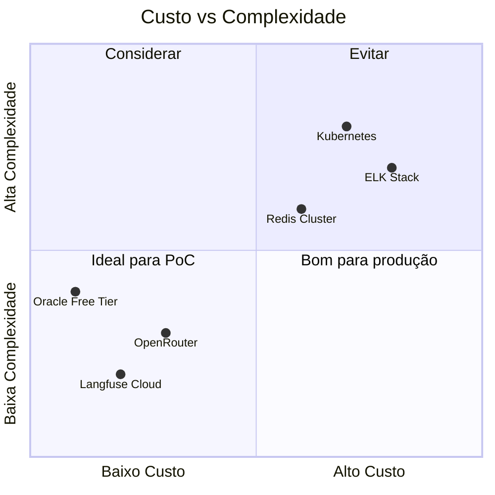

## Evolução Futura

```mermaid
roadmap
    title Evolucao do DemoAgencia
    section PoC (Atual)
    Worker Service :done, 2025-01, 2025-03
    Telegram Bot :done, 2025-01, 2025-03
    Agentes .md :done, 2025-01, 2025-03
    Loop de Orquestracao :done, 2025-03, 2025-06
    OpenRouter :done, 2025-02, 2025-04
    Langfuse :done, 2025-02, 2025-04
    Referencias de Clientes :done, 2025-06, 2025-07
    
    section MVP
    Banco de dados :2026-01, 2026-03
    Autenticacao :2026-02, 2026-04
    Multi-tenant :2026-03, 2026-05
    
    section Producao
    Kubernetes :2026-06, 2026-08
    Monitoramento avancado :2026-06, 2026-07
    Auto-scaling :2026-07, 2026-09
```

## Referencias

- [RUNBOOK.md](../RUNBOOK.md) - Guia de deploy e operacao
- [CHECKLIST.md](../CHECKLIST.md) - Checklist de aceite E2E
