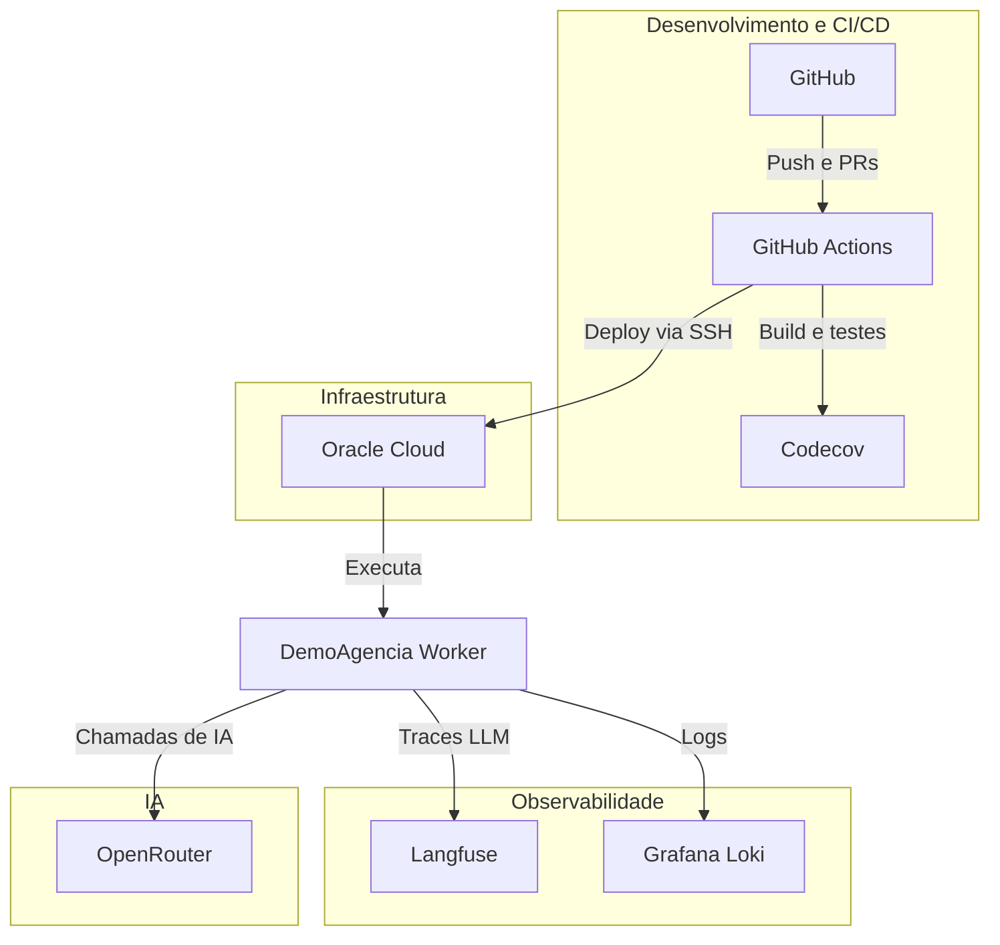
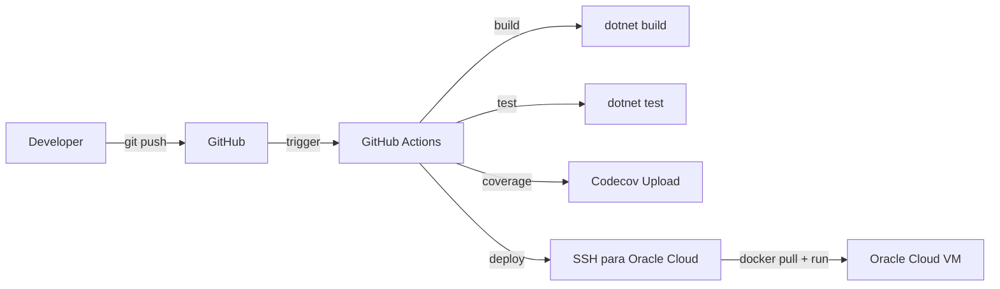
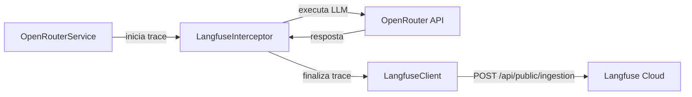

# Ferramentas e Servicos

Visao geral das ferramentas e servicos utilizados no projeto DemoAgencia.

## Visao Geral

---

## GitHub

**Funcao:** Repositorio de codigo-fonte, controle de versao e CI/CD.

| Aspecto | Detalhe |
|---------|---------|
| Tipo | Plataforma DevOps |
| Uso no projeto | Hospedagem do repositorio, pull requests, revisao de codigo |
| CI/CD | GitHub Actions para build, testes e deploy automatizado |
| Plano | Free (repositorio publico ou privado com limites) |

**Fluxo de CI/CD:**

---

## OpenRouter

**Funcao:** Gateway unificado de acesso a modelos de linguagem (LLM).

| Aspecto | Detalhe |
|---------|---------|
| Tipo | API Gateway para LLMs |
| Uso no projeto | Acesso a multiplos modelos (Qwen, DeepSeek) com uma unica API |
| Integracao | Via Semantic Kernel (SK) no `OpenRouterService` |
| Plano | Pay-per-use (cobranca por tokens consumidos) |

**Modelos utilizados:**

| Modelo | Agente | Finalidade |
|--------|--------|------------|
| `deepseek/deepseek-v3.2` | router | Intake, classificacao e estruturação do brief |
| `qwen/qwen3.7-plus` | redator, hero | Copy de email e direcao de arte para imagem hero |
| `deepseek/deepseek-r1-0528` | qa | Revisor critico independente |
| `qwen/qwen2.5-vl-72b-instruct` | (visao) | Analise de imagens (multimodal) |
| `qwen/qwen-image-3-pro` | (imagem) | Geracao de imagens |

---

## Langfuse

**Funcao:** Observabilidade e rastreamento de chamadas LLM (LLMOps).

| Aspecto | Detalhe |
|---------|---------|
| Tipo | Plataforma LLMOps |
| Uso no projeto | Traces de cada interacao com LLM (input, output, tokens, duracao) |
| Integracao | `LangfuseInterceptor` + `LangfuseClient` via HTTP API |
| Plano | Cloud Free Tier (50k traces/mes) |

**Fluxo de rastreamento:**

---

## Grafana Loki

**Funcao:** Agregacao e consulta de logs da aplicacao.

| Aspecto | Detalhe |
|---------|---------|
| Tipo | Sistema de logging |
| Uso no projeto | Centralizacao de logs estruturados do worker |
| Integracao | Serilog com sink para Grafana Loki |
| Plano | Grafana Cloud Free Tier |

---

## Codecov

**Funcao:** Relatorio e monitoramento de cobertura de testes.

| Aspecto | Detalhe |
|---------|---------|
| Tipo | Plataforma de cobertura de codigo |
| Uso no projeto | Analise de cobertura dos 162 testes unitarios |
| Integracao | Upload via GitHub Actions apos `dotnet test --collect:"XPlat Code Coverage"` |
| Plano | Free para repositorios publicos |

---

## Oracle Cloud

**Funcao:** Infraestrutura de hospedagem do worker em producao.

| Aspecto | Detalhe |
|---------|---------|
| Tipo | Cloud IaaS (Infraestrutura como Servico) |
| Uso no projeto | VM ARM64 para execucao do container Docker |
| Integracao | Deploy via SSH a partir do GitHub Actions |
| Plano | Always Free Tier (gratuito permanentemente) |

**Recursos utilizados:**

| Recurso | Especificacao |
|---------|---------------|
| Compute | VM ARM64 Ampere A1 (4 OCPUs, 24 GB RAM) |
| SO | Ubuntu Server |
| Rede | VPC com IP publico |
| Armazenamento | Block Volume 50 GB |

---

## Resumo da Integracao

| Ferramenta | Categoria | Custo | Critico? |
|------------|-----------|-------|----------|
| GitHub | CI/CD e codigo | Free | Sim |
| OpenRouter | IA (LLMs) | Pay-per-use | Sim |
| Langfuse | Observabilidade LLM | Free (50k traces/mes) | Nao |
| Grafana Loki | Logs | Free Tier | Nao |
| Codecov | Cobertura de testes | Free (repos publicos) | Nao |
| Oracle Cloud | Infraestrutura | Always Free | Sim |

## Referencias

- [ARCHITECTURE.md](./ARCHITECTURE.md) - Arquitetura detalhada do sistema
- [DEVELOPMENT.md](./DEVELOPMENT.md) - Guia de desenvolvimento e variaveis de ambiente
- [RUNBOOK.md](../RUNBOOK.md) - Guia de deploy e operacao
